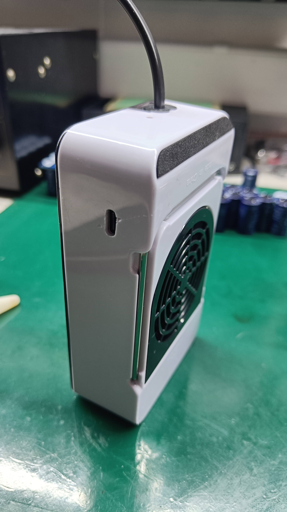
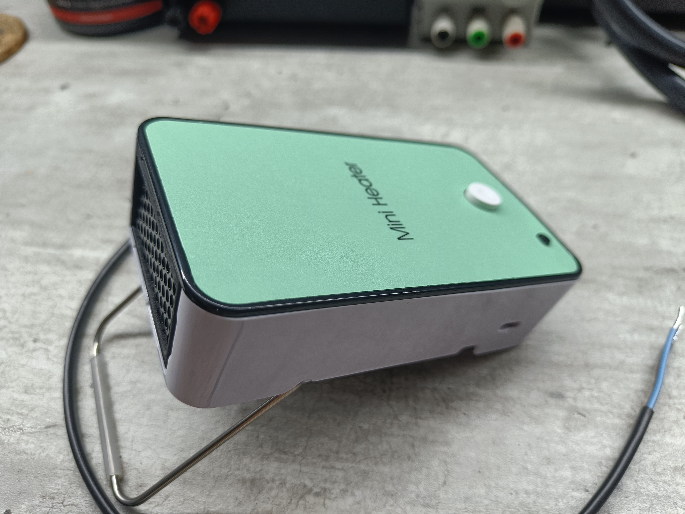
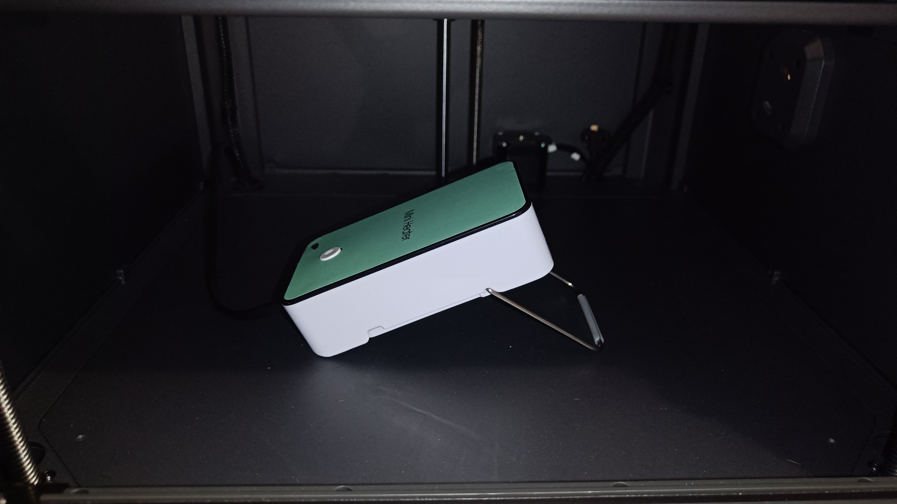

# Elegoo Centauri Carbon automatic chamber heater firmware

[](https://github.com/AEdison-tech/Auto-CC-heater-firmware/actions/workflows/firmware.yml)
[](LICENSE)
[](platformio.ini)

An ESP32-C3 based controller that automatically heats a 3D printer enclosure by monitoring the Elegoo Centauri Carbon printer's status via WebSocket and controlling a relay-driven heater with a fan and temperature sensor.

> **Inspired by** [BIQU Panda Breath](https://github.com/bigtreetech/Panda-Breath) for Bambu Lab X1C/P1S/A1 — a similar concept brought to the Elegoo Centauri Carbon ecosystem.
>
> **Built on top of** the excellent work by [jrowny/cc_sfs](https://github.com/jrowny/cc_sfs) and [mikeleet/cc_sfs_cf](https://github.com/mikeleet/cc_sfs_cf). Many thanks to both authors — the WebSocket communication layer, web UI architecture, and ESP32 integration patterns in this project are derived from their work. Please check out their repositories!

---

## Hardware





> 🔧 PCB design and assembly instructions live in a separate repository:
> **[AEdison-tech/Auto-CC-heater-hardware](https://github.com/AEdison-tech/Auto-CC-heater-hardware)**.

| Component | Description |
|-----------|-------------|
| ESP32-C3 (Adafruit QT Py) | Main controller |
| Relay module | Controls the heater element (pin 1) |
| Fan | Heater cooling / air circulation (pin 4) |
| DS18B20 | One-wire temperature sensor inside the enclosure (pin 3) |
| Status LED | Active-low indicator LED (pin 0) |

### Default Pin Assignments

```
RELAY_PIN       = 1
FAN_PIN         = 4
STATUS_LED_PIN  = 0   (active-low)
TEMP_SENSOR_PIN = 3   (DS18B20 one-wire)
```

Pins can be overridden in `platformio.ini` via `build_flags`.

---

## Features

- **Automatic activation** — heater starts when the printer's bed temperature crosses a configurable threshold (optionally only during an active print)
- **Temperature control source** — choose between the local DS18B20 sensor or the printer's reported chamber temperature (TempOfBox) for on/off control
- **Hysteresis control** — stable on/off switching around the target temperature using a configurable dead-band
- **Fan cooldown** — fan runs for 30 seconds after the heater turns off to dissipate residual heat
- **Wi-Fi provisioning** via [Improv Serial](https://www.improv-wifi.com/) or AP mode fallback
- **Web interface** — responsive SPA (Solid.js + DaisyUI) served directly from the ESP32's LittleFS filesystem
- **OTA firmware update** via [ElegantOTA](https://github.com/ayushsharma82/ElegantOTA)
- **Debug mode** — override bed temp, heater temp, chamber temp, and printing state without a real printer
- **mDNS** — accessible at `http://ccheater.local` on the local network

---

## How It Works

### Activation

1. The ESP32 connects to the Elegoo Centauri Carbon printer via WebSocket (port 3030).
2. Every loop it reads `TempOfHotbed` (bed temperature) and printing state from the printer's SDCP status messages.
3. The heater is **allowed to run** when:
   - Bed temperature ≥ `activation_temp` threshold, **AND**
   - A print is active *(optional — can be disabled with the "Start Only When Printing" setting)*

### Temperature Control

Once activation conditions are met, the heater is controlled by hysteresis:

- **Heater ON** when control temperature ≤ `target_temp − hysteresis`
- **Heater OFF** when control temperature ≥ `target_temp + hysteresis`

The **control temperature source** is configurable:
- `Heater Temperature` — DS18B20 sensor mounted in the enclosure *(default)*
- `Chamber Temperature` — `TempOfBox` reported by the printer

---

## Prerequisites

- [PlatformIO](https://platformio.org/) (VS Code extension or CLI)
- [Node.js](https://nodejs.org/) ≥ 18 (for building the web UI)
- Elegoo Centauri Carbon resin printer on the same local network

## Building & Flashing

```bash
# Clone the repository
git clone https://github.com/AEdison-tech/Auto-CC-heater-firmware.git
cd Auto-CC-heater-firmware

# Copy and edit the settings template before first flash
cp data/user_settings.example.json data/user_settings.json
# (edit user_settings.json with your WiFi and printer IP)

# Build and upload firmware + filesystem
# (PlatformIO automatically builds the web UI via build_web.py)
pio run --target upload
pio run --target uploadfs
```

The `build_web.py` pre-build script automatically:
1. Runs `npm install` inside `webui/` if needed
2. Builds the Solid.js frontend with Vite
3. Copies and gzip-compresses the output to `data/`

## First-Time Setup

1. After flashing, the device starts in **AP mode** — connect to Wi-Fi network `ElegooChamberHeater` (password: `elegoocc`).
2. Open `http://10.10.10.10` in your browser.
3. Enter your Wi-Fi credentials and the printer's IP address, then save.
4. The device reboots into station mode and is reachable at `http://ccheater.local` (or its assigned IP).

Alternatively, use **Improv Serial** provisioning via the serial monitor right after flashing.

---

## Web Interface

| Page | Description |
|------|-------------|
| **Status** | Real-time temperatures, heater/fan state, printer connection |
| **Settings** | All configuration options (see below) |
| **Debug** | Manual override of temperatures and printing state for testing |
| **Logs** | Live serial log viewer |
| **Update** | OTA firmware update (via ElegantOTA) |
| **About** | Firmware version and chip info |

---

## Configuration

All settings are stored in `/user_settings.json` on LittleFS and editable via the web UI.

| Setting | Default | Description |
|---------|---------|-------------|
| `ssid` | — | Wi-Fi network name |
| `passwd` | — | Wi-Fi password |
| `elegooip` | — | Printer IP address |
| `activation_temp` | `85.0` °C | Bed temperature threshold to allow heating |
| `require_printing` | `false` | Require an active print for the heater to activate |
| `control_source` | `"heater"` | Temperature source for on/off control: `"heater"` (DS18B20) or `"chamber"` (TempOfBox) |
| `target_temp` | `60.0` °C | Desired enclosure temperature |
| `hysteresis` | `5.0` °C | Dead-band around target (heater ON below target−hyst, OFF above target+hyst) |
| `enabled` | `true` | Master enable/disable switch |
| `debug` | `false` | Show the Debug page and enable temperature/state overrides |

---

## Acknowledgements

This project would not exist without the groundwork laid by:

- **[jrowny/cc_sfs](https://github.com/jrowny/cc_sfs)** — the original ESP32 filament sensor project for the Elegoo Centauri Carbon, which established the WebSocket communication protocol, LittleFS-based web UI delivery, and overall firmware architecture used here.
- **[mikeleet/cc_sfs_cf](https://github.com/mikeleet/cc_sfs_cf)** — an enhanced fork with a modern Solid.js web interface, improved firmware structure, and additional features. The web UI in this project is directly derived from this work.
- **[BIQU Panda Breath](https://github.com/bigtreetech/Panda-Breath)** — inspiration for applying the chamber-heater concept to the resin printing workflow.

---

## License

MIT License — see [LICENSE](LICENSE) for details.
